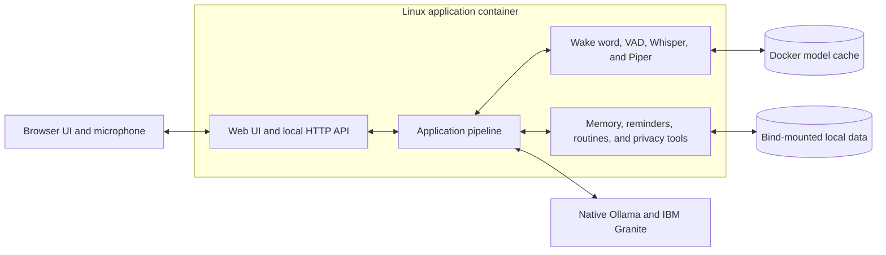

# Granite Voice Concierge

Granite Voice Concierge is an offline-first, voice-first assistant prototype
designed to support independent living. It combines local IBM Granite
reasoning with speech recognition, speech synthesis, reminders, guided
routines, and user-controlled memory in a browser-based interface.

Normal application processing remains on the local device. Ollama provides
local model inference, and the application stores approved memories and
reminders in local persistent storage.

## Project status

This repository is an active prototype, not a certified medical device,
emergency-response system, or production care service. It should not be relied
on as the sole means of obtaining urgent help, medical guidance, or safety
monitoring.

The reference deployment is currently Apple Silicon macOS with Docker Desktop
and native Ollama. The application runs in a Linux container, while Ollama runs
on the host to retain Apple Metal acceleration. Other host platforms require
validation before they should be considered supported.

## Core capabilities

| Area                 | Capability                                                                                       |
| -------------------- | ------------------------------------------------------------------------------------------------ |
| Local reasoning      | Runs IBM Granite models locally through Ollama.                                                  |
| Voice interaction    | Supports push-to-talk, wake-word mode, silence detection, and local transcription.               |
| Speech output        | Uses Piper with platform-appropriate local fallbacks and browser playback controls.              |
| Personal memory      | Stores approved preferences and facts locally with review, edit, export, and deletion controls.  |
| Reminders and timers | Creates, edits, snoozes, repeats, and cancels locally persisted reminders.                       |
| Guided routines      | Provides paced, step-by-step guidance with pause, repeat, navigation, and speed controls.        |
| Context modes        | Adapts response behavior for home, cooking, shopping, driving, and accessibility needs.          |
| Browser interface    | Provides conversation, voice capture, local-data management, settings, and diagnostic workflows. |

## Design principles

- **Local by default:** normal reasoning, speech processing, memory, and
  scheduling do not require a cloud service after models are installed.
- **User-controlled memory:** memory mutations require explicit application
  flows, and stored items remain reviewable and removable.
- **Graceful degradation:** text remains available when microphone,
  transcription, or speech output components are unavailable.
- **Safety-aware interaction:** destructive actions require confirmation, and
  urgent safety language follows deterministic local handling.
- **Replaceable boundaries:** application-owned interfaces isolate model,
  storage, speech, and external-service implementations.

## Architecture



The browser and API are bound to the local machine by default. Ollama is not
packaged inside the application container; Compose connects to the Ollama
service running on the host.

## Quick start

### Prerequisites

- [Docker with Docker Compose](https://docs.docker.com/get-started/get-docker/)
- [Ollama](https://ollama.com/download), installed on the host rather than in a
  container, so it can use the machine's GPU
- Roughly 8 GB of free memory for the default Granite model, and about 6 GB of
  disk for the model downloads

Ollama runs natively and the application runs in Docker. The container reaches
Ollama through the host gateway, which works the same way on all three
platforms.

### Start the application

From the repository root.

**macOS and Linux**

```bash
cp .env.example .env
./scripts/quickstart.sh
```

**Windows (PowerShell)**

```powershell
Copy-Item .env.example .env
.\scripts\quickstart.ps1
```

If PowerShell refuses to run the script, allow local scripts for this session
only:

```powershell
Set-ExecutionPolicy -Scope Process -ExecutionPolicy Bypass
```

The script checks the host services, downloads the configured Ollama models,
builds the application image, verifies container-to-host connectivity, and
starts the service.

Open `http://127.0.0.1:4173` after startup completes.

The page is served by the container, so it only loads while the container
is running. If the browser cannot connect, check the service is up with
`make ps` (or `docker compose ps`) and start it again with `make up` (or
`docker compose up -d`) if it is not.

Once it is running, use whichever column matches your machine. The `make`
targets are shorthand for the same `docker compose` commands, and Windows has
no `make` by default.

| Task | macOS and Linux | Windows (PowerShell) |
| --- | --- | --- |
| Check the service | `make ps` | `docker compose ps` |
| Follow the logs | `make logs` | `docker compose logs -f voice-concierge` |
| Stop, keeping data | `make down` | `docker compose down` |
| Open a shell in it | `make shell` | `docker compose exec voice-concierge /bin/bash` |

The `docker compose` forms work everywhere, so use them on macOS or Linux too
if you prefer not to rely on `make`.

Check the application is healthy on any platform with:

```bash
curl http://127.0.0.1:4173/api/health
```

For manual startup, host development, troubleshooting, and the complete Make
target reference, see the
[development and operations guide](docs/development-guide.md).

## Configuration

Local configuration is read from the ignored `.env` file. Start from
[`.env.example`](.env.example).

| Variable         | Default                             | Purpose                                       |
| ---------------- | ----------------------------------- | --------------------------------------------- |
| `OLLAMA_API_URL` | `http://host.docker.internal:11434` | Ollama endpoint reachable from the container. |
| `OLLAMA_MODEL`   | `granite4.1:8b`                     | Local reasoning model selected at startup.    |
| `GVC_LOG_LEVEL`  | `INFO`                              | Application diagnostic verbosity.             |

The quick-start workflow installs `granite-embedding:278m` by default. Override
that one invocation by exporting `OLLAMA_EMBEDDING_MODEL` in the shell before
running the script.

Do not commit `.env`, credentials, downloaded model weights, generated audio,
or local user data.

## Data and privacy

The Docker deployment separates application data from model caches:

| Data                                  | Location                    | Persistence                                       |
| ------------------------------------- | --------------------------- | ------------------------------------------------- |
| Memories, reminders, and preferences | `./data/.local`             | Bind-mounted and retained across normal rebuilds. |
| Whisper and application model caches  | Docker volume `voice-model-cache` | Retained until the volume is removed.        |
| Ollama models                         | Host Ollama data directory  | Managed outside the application container.        |
| Temporary conversation state          | Application process memory  | Cleared when the session or server is reset.      |

Recorded audio is processed in memory and is not persisted by the normal
application flow. Browser speech fallback is restricted to voices that the Web
Speech API identifies as local services.

The default `INFO` logging configuration does not record conversation text.
Setting `GVC_LOG_LEVEL=DEBUG` includes prompts and responses that may be retained
by the container logging driver. Enable it only for deliberate local
troubleshooting.

`make clean` and `make rebuild` delete application state under
`./data/.local`. Review the
[persistent-data documentation](docs/development-guide.md#persistent-data)
before using either command.

## Development and verification

Run the complete test suite in the isolated Docker test image:

```bash
make test
```

For host development, create a Python 3.12 environment and install the
development dependency group as described in the
[development guide](docs/development-guide.md#host-development-setup).

The standard quality checks are:

```bash
python -m black .
python -m ruff check .
python -m pytest
```

All substantive changes should pass formatting, linting, and relevant tests
before review.

## Documentation

| Document                                                       | Purpose                                                                   |
| -------------------------------------------------------------- | ------------------------------------------------------------------------- |
| [Development and operations guide](docs/development-guide.md)  | Docker, host setup, configuration, persistence, commands, and testing.    |
| [Local end-to-end setup](docs/app-pipeline-local-e2e-setup.md) | Detailed model, microphone, speech, and live-pipeline setup.              |
| [Web UI guide](web/README.md)                                  | Browser architecture, API behavior, wake mode, playback, and diagnostics. |
| [Application/UI contract](docs/app-pipeline-ui-contract.md)    | Serialized request, response, state, and trust boundaries.                |
| [Local reasoning guide](docs/reasoning/local-reasoning.md)     | Ollama integration, model configuration, and reasoning behavior.          |
| [Memory design](docs/memory/memory.md)                         | Local memory architecture and behavior.                                   |
| [Repository structure](docs/repository-structure.md)           | Package and directory responsibilities.                                   |
| [Development workflow](docs/development-workflow.md)           | Branch, issue, review, and merge conventions.                             |
| [Python style guide](docs/python-style-guide.md)               | Python formatting and coding conventions.                                 |

## Security and responsible use

- The default web binding is local-only. Do not expose the service publicly
  without authentication, TLS, access controls, and a deployment review.
- Local inference reduces external data exposure but does not make model output
  inherently correct. Important information must still be verified.
- Voice recognition can mishear commands. Destructive and sensitive operations
  should retain explicit confirmation boundaries.
- Do not store secrets, credentials, medical records, or other sensitive data
  unless the deployment and retention controls have been reviewed for that use.

## License

This repository does not currently include an open-source license. Do not
assume permission to redistribute or incorporate the software into another
project until a license has been selected.
