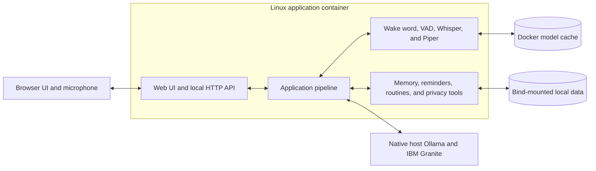

# Granite Voice Concierge

Granite Voice Concierge is an offline-first, voice-first assistant prototype
designed to support independent living. It combines local IBM Granite
reasoning with speech recognition, speech synthesis, reminders, guided
routines, and user-controlled memory in a browser-based interface.

Normal application processing remains on the local device. Ollama provides
local model inference, and the application stores approved memories and
reminders in local persistent storage.

> This is an active prototype, not a medical device or emergency-response
> system. Do not rely on it as the only way to obtain urgent help or medical
> guidance.

## Core capabilities

| Area                 | Capability                                                                                       |
| -------------------- | ------------------------------------------------------------------------------------------------ |
| Local reasoning      | Runs IBM Granite models locally through Ollama.                                                  |
| Voice interaction    | Supports push-to-talk, wake-word mode, silence detection, and local transcription.               |
| Speech output        | Uses Piper with platform-appropriate local fallbacks and browser playback controls.              |
| Personal memory      | Stores approved preferences and facts locally with review, edit, export, and deletion controls.  |
| Reminders and timers | Creates, edits, snoozes, repeats, and cancels locally persisted reminders.                       |
| Guided routines      | Provides paced, step-by-step guidance with pause, repeat, navigation, and speed controls.        |
| Context modes        | Adapts response behavior for home, cooking, shopping, driving, and accessibility needs.          |
| Browser interface    | Provides conversation, voice capture, local-data management, settings, and diagnostic workflows. |

## Design principles

- **Local by default:** normal reasoning, speech processing, memory, and
  scheduling do not require a cloud service after models are installed.
- **User-controlled memory:** memory mutations require explicit application
  flows, and stored items remain reviewable and removable.
- **Graceful degradation:** text remains available when microphone,
  transcription, or speech output components are unavailable.
- **Safety-aware interaction:** destructive actions require confirmation, and
  urgent safety language follows deterministic local handling.
- **Replaceable boundaries:** application-owned interfaces isolate model,
  storage, speech, and external-service implementations.

## Architecture



The browser and API are bound to the local machine by default. Ollama is not
packaged inside the application container; Compose connects to Ollama running
on the host.

## Docker setup

### Prerequisites

- Git
- [Docker Desktop](https://docs.docker.com/get-started/get-docker/)
- [Ollama](https://ollama.com/download), installed and running on the host
- Sufficient disk space and memory for the selected Granite and speech models

Supported hosts are Apple Silicon macOS and x86-64 Windows with Docker Desktop
using WSL 2 and Linux containers. Windows on Arm has not been validated. The
first setup requires internet access and downloads several gigabytes; normal
operation remains local after the images and models are available.

### System requirements and download sizes

| Resource        | Minimum                                                          |
| --------------- | ---------------------------------------------------------------- |
| Host            | Apple Silicon Mac or x86-64 Windows PC with WSL 2 virtualization |
| CPU             | 4 modern CPU cores                                               |
| System memory   | 16 GB RAM                                                        |
| Free disk space | 20 GB before the first run                                       |

The default model assets use approximately:

| Asset                                                                                 | Approximate size |
| ------------------------------------------------------------------------------------- | ---------------- |
| [`granite4.1:8b`](https://ollama.com/library/granite4.1) reasoning model              | 5.3 GB           |
| [`granite-embedding:278m`](https://ollama.com/library/granite-embedding) memory model | 563 MB           |
| Speech, wake-word, and voice models                                                   | About 300 MB     |
| Application image, dependency layers, and Docker build cache                          | Allow 4–8 GB     |

The two Ollama models total about 5.9 GB, and all listed model assets total
about 6.2 GB. The application image, CPU-only PyTorch, Python and system
packages, wake-word/VAD assets, Docker layers, and build cache bring the normal
initial footprint to roughly 10–15 GB. Their exact size varies by host
architecture, package versions, and retained build layers. The free-space
figures above include working room for updates and temporary build data.

### Clone the repository

Run once in Terminal on macOS or PowerShell on Windows:

```text
git clone https://github.com/IBM-x-UCL-Summer-Project/granite-voice-concierge.git
cd granite-voice-concierge
```

Run all remaining commands from this repository root.

### Windows

#### Configure Ollama for Windows once

Run in PowerShell:

```powershell
[Environment]::SetEnvironmentVariable(
    "OLLAMA_HOST",
    "0.0.0.0:11434",
    "User"
)
```

Quit Ollama from its taskbar icon, start it again from the Windows Start menu,
then verify its local API:

```powershell
Invoke-RestMethod http://127.0.0.1:11434/api/tags
```

Keep TCP port `11434` blocked from public and untrusted networks. The container
uses Docker Desktop's `host.docker.internal` address; Compose does not publish
the Ollama port.

#### Start

```powershell
powershell -NoProfile -ExecutionPolicy Bypass -File .\scripts\quickstart.ps1
```

The launcher creates `.env` when needed, downloads missing Ollama models,
builds the image, checks host connectivity, starts the container, and waits for
the application. Open [http://127.0.0.1:4173](http://127.0.0.1:4173) after it
reports that the application is ready.

#### Verify and operate

```powershell
# Check status and application health
docker compose ps
Invoke-RestMethod http://127.0.0.1:4173/api/health

# Follow logs; press Ctrl-C to stop following
docker compose logs --tail 100 -f voice-concierge

# Restart the application
docker compose restart voice-concierge

# Stop while retaining data and model caches
docker compose down

# Start an existing deployment without rebuilding
docker compose up -d
```

#### Update

```powershell
git pull --ff-only
powershell -NoProfile -ExecutionPolicy Bypass -File .\scripts\quickstart.ps1
```

For startup options, data locations, networking details, and error-specific
diagnostics, see the [Windows Docker guide](docs/windows-docker.md).

### macOS

#### Configure Ollama for macOS once

Run in Terminal:

```bash
launchctl setenv OLLAMA_HOST "0.0.0.0:11434"
```

Quit and reopen the Ollama application, then verify its local API:

```bash
curl --fail http://127.0.0.1:11434/api/tags
```

#### Start

```bash
cp .env.example .env
./scripts/quickstart.sh
```

The launcher downloads missing Ollama models, builds the image, checks host
connectivity, and starts the container. Open
[http://127.0.0.1:4173](http://127.0.0.1:4173) after startup.

#### Verify and operate

```bash
# Check status and application health
docker compose ps
curl --fail http://127.0.0.1:4173/api/health

# Follow logs; press Ctrl-C to stop following
docker compose logs --tail 100 -f voice-concierge

# Restart the application
docker compose restart voice-concierge

# Stop while retaining data and model caches
docker compose down

# Start an existing deployment without rebuilding
docker compose up -d
```

Equivalent shortcuts are available through `make ps`, `make logs`, `make down`,
and `make up`.

#### Update

```bash
git pull --ff-only
./scripts/quickstart.sh
```

## Configuration and local data

Configuration is read from the ignored `.env` file.

| Variable               | Default                             | Purpose                                  |
| ---------------------- | ----------------------------------- | ---------------------------------------- |
| `OLLAMA_API_URL`       | `http://host.docker.internal:11434` | Ollama address from the container        |
| `OLLAMA_MODEL`         | `granite4.1:8b`                     | Local reasoning model                    |
| `GVC_STT_MODEL`        | `base.en`                           | faster-whisper model name, ID, or path   |
| `GVC_STT_DEVICE`       | `cpu`                               | CTranslate2 inference device             |
| `GVC_STT_COMPUTE_TYPE` | `int8`                              | CTranslate2 inference precision          |
| `GVC_TTS_VOICE`        | `en_GB-alan-medium`                 | Piper voice built into the Docker image  |
| `GVC_LOG_LEVEL`        | `INFO`                              | Application logging level                |

`GVC_STT_MODEL` is passed through to faster-whisper, so installations can use
smaller or larger built-in names such as `tiny.en`, `small.en`, `medium.en`,
`large-v3`, `turbo`, and `distil-large-v3`, a compatible Hugging Face model ID,
or a converted local model directory. The selected model downloads into the
persistent `voice-model-cache` on first use. An explicitly selected model is
never silently replaced with a smaller one if loading fails.

`GVC_TTS_VOICE` uses Piper's `<language>-<name>-<quality>` identifiers. The
quick-start build downloads only the selected voice into the image. After
changing it, rerun the quick-start script or `docker compose build`. To inspect
the upstream catalogue from an installed development environment:

```bash
python -m voice_concierge.voice_output.download_models --list
```

Piper voice files have individual model cards and may use different licences.
Review the selected voice's model card before redistributing an image containing
it.

| Data                                  | Location                          |
| ------------------------------------- | --------------------------------- |
| Memories, reminders, and preferences  | `data/.local`                     |
| Whisper, Vosk, and application caches | Docker volume `voice-model-cache` |
| Ollama models                         | Native host Ollama storage        |

Normal `docker compose down`, rebuilds, and updates retain these locations.
Deleting `data/.local` removes saved user data. `docker compose down -v`
deletes the application model cache. Debug logging can contain prompts and
responses; enable it only for deliberate local troubleshooting.

## Development

Run the standard checks before review:

```bash
python -m black .
python -m ruff check .
python -m pytest
```

The isolated Docker test target is available with `make test`. Host development
setup and the complete operations reference are in the
[development guide](docs/development-guide.md).

## Documentation

- [Windows Docker support and troubleshooting](docs/windows-docker.md)
- [Development and operations](docs/development-guide.md)
- [Local end-to-end setup](docs/app-pipeline-local-e2e-setup.md)
- [Web interface and browser behavior](web/README.md)
- [Local reasoning](docs/reasoning/local-reasoning.md)
- [Memory design](docs/memory/memory.md)
- [Repository structure](docs/repository-structure.md)
- [Development workflow](docs/development-workflow.md)

## Security and responsible use

The web interface binds to `127.0.0.1` by default. Do not expose it publicly
without authentication, TLS, access controls, and a deployment review. Local
inference does not make model output inherently correct; verify important
information. Do not commit `.env`, credentials, model weights, generated audio,
or local user data.

## License

This project is licensed under the [MIT License](LICENSE).
